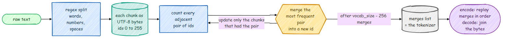

# Tokenizers: BPE From Scratch

The pretraining path of this repo uses OpenAI's `r50k_base` tokenizer (the GPT-2 one) through
`tiktoken`. The laptop track trains its own instead, with `src/tokenizer/bpe.py`: about 250
lines that implement the same algorithm as the GPT-2, GPT-4 and Llama 3 tokenizers. This page
walks through it.



## Why bytes, and why merges

A tokenizer has to turn *any* text into ids from a fixed vocabulary. Two extremes fail:

- **Words** as tokens: the vocabulary explodes (names, typos, code, other languages) and any
  word not in it is lost.
- **Characters** or **bytes**: nothing is ever unknown, but sequences get long, and attention
  cost grows with the square of the length.

Byte Pair Encoding ([Sennrich et al., 2016](https://arxiv.org/abs/1508.07909)), in its byte-level
form from GPT-2, starts from the 256 possible byte values, so every string can be encoded, and
then *learns* bigger pieces from data. It repeatedly finds the most frequent pair of adjacent
ids and gives that pair a new id. Frequent words end up as one token, rare words as a few
pieces, and anything else as raw bytes.

## A tiny example

Train on the string `aaabdaaabac` with room for three merges:

```python
from src.tokenizer import BPETokenizer

tok = BPETokenizer.train("aaabdaaabac", vocab_size=256 + 3 + 1)   # 256 bytes, 3 merges, 1 special token
for i, (a, b) in enumerate(tok.merges):
    print(tok.token_bytes(a), "+", tok.token_bytes(b), "->", tok.token_bytes(256 + i))
# b'a' + b'a' -> b'aa'       (the pair "a a" appears 4 times)
# b'a' + b'b' -> b'ab'
# b'aa' + b'ab' -> b'aaab'
print([tok.token_bytes(i) for i in tok.encode_ordinary("aaabdaaabac")])
# [b'aaab', b'd', b'aaab', b'a', b'c']   11 bytes became 5 tokens
```

The merges list *is* the tokenizer. Encoding replays the merges in the order they were learned,
and decoding concatenates the bytes behind every id.

## Step 1: split the text into chunks

Merges never cross chunk boundaries. Without this, the tokenizer would learn tokens like
`"dog."` and `"dog!"` and `"dog,"` separately, wasting the vocabulary. A regular expression cuts
the text into words, numbers, punctuation and spaces first. We use the GPT-4 pattern:

```python
import regex
from src.tokenizer.bpe import GPT4_SPLIT_PATTERN

regex.findall(GPT4_SPLIT_PATTERN, "Tim's dog ran 12345 meters!!  Then he slept.")
# ['Tim', "'s", ' dog', ' ran', ' ', '123', '45', ' meters', '!!', ' ', ' Then', ' he', ' slept', '.']
```

Three details are visible here: a word keeps its leading space (`' dog'`), so the tokenizer can
tell a word start from a word middle; contractions like `'s` are split off; and numbers are cut
into groups of at most three digits, which keeps the vocabulary from filling up with numbers
and makes arithmetic more regular.

## Step 2: count pairs, merge, repeat

The naive algorithm recounts every pair in the whole text after every merge. With 4,000 merges
over 10 MB of text, that is slow. `BPETokenizer.train` uses the standard faster version:

1. Count each distinct chunk once (`" the"` appears a million times but is stored once, with
   its count).
2. Count every adjacent pair, weighted by its chunk's count, and remember which chunks contain
   which pair.
3. Pop the most frequent pair from a heap, merge it, and update the counts *only for the chunks
   that contained it*. Pair counts that changed go back on the heap; stale heap entries are
   skipped when popped.

```python
while len(merges) < n_merges and heap:
    neg_count, pair = heapq.heappop(heap)
    if -neg_count != pair_counts.get(pair, 0):   # stale entry: re-push with the real count
        ...
    new_id = 256 + len(merges)
    merges.append(pair)
    for wi in where.pop(pair, ()):                # only the chunks that contain the pair
        old, new = words[wi], _merge(words[wi], pair, new_id)
        for p in zip(old, old[1:]):
            pair_counts[p] -= freqs[wi]
        for p in zip(new, new[1:]):
            pair_counts[p] += freqs[wi]
```

`scripts/prepare_tiny_data.py` trains a 4,096-token vocabulary on 10 MB of TinyStories in
about 4 seconds on a laptop CPU.

## What it learns

The first merges are the most common pairs in English, and later merges are whole words. From
the tokenizer trained on TinyStories (`data/tiny/tokenizer.json`):

```text
first merges:  ' t'  'he'  ' a'  ' s'  ' w'  ' the'  'nd'  'ed'  ' b'  ' to'
last merges:   ' task'  ' dive'  ' purse'  'ately'  ' Sunny'
```

```python
tok = BPETokenizer.load("data/tiny/tokenizer.json")
text = "Once upon a time, a little girl named Lily found a shiny red ball in the garden."
[tok.decode([i]) for i in tok.encode_ordinary(text)]
# ['Once', ' upon', ' a', ' time', ',', ' a', ' little', ' girl', ' named', ' Lily', ' found',
#  ' a', ' shiny', ' red', ' ball', ' in', ' the', ' garden', '.']      80 characters, 19 tokens
[tok.decode([i]) for i in tok.encode_ordinary("Photosynthesis is fascinating!")]
# ['P', 'h', 'ot', 'os', 'y', 'nt', 'hes', 'is', ' is', ' fa', 'sc', 'in', 'at', 'ing', '!']
```

Every word of the story sentence is one token. The science sentence falls apart into 15 pieces
(`r50k_base` needs 5), because children's stories never mention photosynthesis. A tokenizer
is only good at the kind of text it was trained on.

## Vocabulary size is a trade-off

Measured on 3 MB of TinyStories validation text:

| Tokenizer | Vocabulary | Characters per token |
|---|---:|---:|
| our BPE, trained on TinyStories | 4,096 | 3.93 |
| `r50k_base` (GPT-2) | 50,257 | 3.95 |
| `cl100k_base` (GPT-4) | 100,277 | 4.07 |

On this text, a vocabulary twelve times smaller compresses almost as well. For a tiny model
that matters a lot: the embedding table has `vocab_size x n_embed` numbers. With `n_embed = 64`,
a 4,096-token vocabulary costs 262K parameters, 71% of the 369K-parameter tiny model. With
`r50k_base` the same table would hold 3.2M parameters, and the "model" would be 97% lookup
table. That is why the student track trains its own tokenizer.

Big models go the other way (Llama 3 uses 128K tokens, Gemma 3 262K): their embedding table is
a small part of the total, and a bigger vocabulary makes sequences shorter in every language.

## Special tokens and safety details

- `<|endoftext|>` gets its own id after the merges. `encode` turns the literal string into that
  id; `encode_ordinary` treats it as plain characters. The data scripts use `encode_ordinary`
  for documents and add the separator id themselves, so a document can never inject one.
- Decoding is byte-based, so a token that ends in the middle of a multi-byte character decodes
  to the replacement character `�` instead of crashing, and a full round trip of any text
  (`"héllo 世界 🙂"`) gives back exactly the same string.
- The tokenizer is saved as a small JSON file and also stored in the HDF5 data files and the
  model checkpoints, so generation always uses the tokenizer the model was trained with.

`tests/test_tokenizer.py` checks round trips on mixed scripts and emoji, that the fast trainer
learns exactly the same merges as the slow textbook version, and that special tokens behave.

## Try it

```bash
python scripts/prepare_tiny_data.py --vocab_size 2048           # smaller vocabulary
python scripts/prepare_tiny_data.py --dataset shakespeare       # a different style of text
python scripts/prepare_tiny_data.py --dataset text --input notes.txt
```

Then compare characters per token (the script prints it) and the dev loss of a model trained on
each. Remember that loss per token is not comparable across tokenizers: a tokenizer with
longer tokens has fewer, harder predictions to make. Compare bits per character instead.
