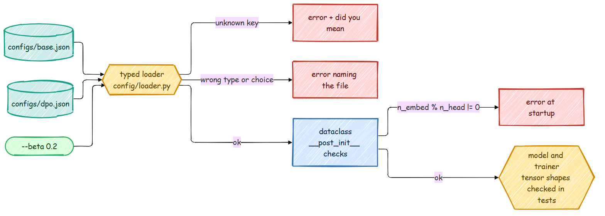

# Type Safety: Configs, Tensor Shapes and mypy

Most bugs in training code do not crash. A typo in a config key keeps the default value, a
tensor with an extra dimension broadcasts into a bigger one, and the run finishes with a
slightly wrong number that nobody notices. The repo catches these early at three levels:
typed configs at startup, tensor shapes in the tests, and static types in CI.



## 1. Typed configs, checked at startup

Every stage config is a dataclass in `config/post_training_config.py`. Fields have real types,
and fields with a fixed set of values use `Literal`:

```python
PreferenceLoss = Literal["dpo", "ipo", "simpo", "orpo", "kto"]

@dataclass
class DPOConfig(BaseModelConfig):
    loss_type: PreferenceLoss = "dpo"   # dpo | ipo | simpo | orpo | kto
    beta: float = 0.1
    label_smoothing: float = 0.0        # > 0 = conservative DPO for noisy preference labels
    ...
    def __post_init__(self) -> None:
        super().__post_init__()
        _check(self.beta > 0, "beta must be positive")
        _check(0.0 <= self.label_smoothing < 0.5, "label_smoothing must be in [0, 0.5)")
```

`config/loader.py` merges `configs/base.json`, the stage JSON and the command line, and checks
every value against these types. The command-line flags are generated from the same
dataclass, so they can never drift apart. Real messages:

```text
$ python scripts/train_dpo.py --config my.json          # my.json: {"betta": 0.1}
train_dpo.py: error: my.json: unknown key 'betta' for DPOConfig (did you mean 'beta'?)

$ python scripts/train_dpo.py --config my.json          # my.json: {"loss_type": "dop"}
train_dpo.py: error: my.json: loss_type must be one of ['dpo', 'ipo', 'simpo', 'orpo', 'kto'], got 'dop'

$ python scripts/train_dpo.py --config my.json          # my.json: {"beta": "high"}
train_dpo.py: error: my.json: beta must be a number, got 'high'

$ python scripts/pretrain_base.py --n_embed 100 --n_head 3
pretrain_base.py: error: n_embed (100) must be divisible by n_head (3) (from command line, configs/base.json, configs/pretrain.json)
```

Before this update, the first one printed a one-line notice and trained with the default
`beta` anyway, whatever the file said. Keys starting with `_` are ignored, so you can still leave notes in a JSON file
(`"_comment": "..."`), and `--print-config` shows the final, merged values without training.

The modern model has its own frozen dataclass, `ModernConfig`, which rejects impossible
shapes when it is built (for example `n_head` not divisible by `n_kv_head`, or an odd head
size, which RoPE cannot rotate).

## 2. Tensor shapes, checked in the tests

The newer modules annotate tensors with [jaxtyping](https://github.com/patrick-kidger/jaxtyping),
which puts the shape in the type:

```python
from jaxtyping import Float, Int
from torch import Tensor

def dpo_loss(
    policy_chosen_logps: Float[Tensor, "batch"],
    policy_rejected_logps: Float[Tensor, "batch"],
    ref_chosen_logps: Float[Tensor, "batch"],
    ref_rejected_logps: Float[Tensor, "batch"],
    beta: float = 0.1,
    label_smoothing: float = 0.0,
) -> LossAndRewards: ...

def forward(self, idx: Int[Tensor, "batch seq"], targets: Int[Tensor, "batch seq"] | None = None
            ) -> tuple[Float[Tensor, "batch seq vocab"], Float[Tensor, ""] | None]: ...
```

Every name is a dimension, and the same name must have the same size everywhere in one call:
all four inputs of `dpo_loss` must have the same `batch`. In a normal run these annotations
cost nothing, they are just documentation that cannot go stale. During the tests,
`tests/conftest.py` installs jaxtyping's import hook with [beartype](https://github.com/beartype/beartype),
which checks every call into the annotated modules.

Here is the kind of bug it catches. Pass a `(4, 1)` tensor where a `(4,)` one belongs:

```python
x = torch.randn(4)
dpo_loss(x, x, x, torch.randn(4, 1))
```

Without the check, PyTorch broadcasts the `(4,)` and `(4, 1)` tensors into a `(4, 4)` matrix,
averages 16 numbers instead of 4, and returns a perfectly plausible loss (0.67 in this case).
With the check:

```text
TypeCheckError: Type-check error whilst checking the parameters of src.post_training.dpo.dpo_loss.
The problem arose whilst typechecking parameter 'ref_rejected_logps'.
Actual value: f32[4,1](torch)
Expected type: <class 'Float[Tensor, 'batch']'>.
```

The checked modules are listed in `tests/conftest.py`: the modern model, LoRA, the optimizers,
the inference code, and the DPO and GRPO losses. Run the tests without the checks (to time
them, for example) with `SHAPE_CHECKS=0 pytest`.

## 3. Static types in CI

[mypy](https://mypy-lang.org/) reads the annotations without running anything. CI runs it on
`src/`, `config/` and `data_loader/`, and the modules added in this update are held to a
stricter standard: every function must be fully annotated (`disallow_untyped_defs` in
`pyproject.toml`). The packages ship a `py.typed` marker, so projects that import them get
the types too.

Some places where the static types earn their keep:

- `src/models/factory.py` returns `LanguageModel = Transformer | ModernTransformer`, so code
  that works with either model is checked against both.
- `src/tokenizer/__init__.py` describes what a tokenizer must provide as a `Protocol`, and both
  `tiktoken.Encoding` and the BPE tokenizer satisfy it without inheriting from anything.
- Config fields typed as `Literal[...]`, with mypy's `strict_equality` on, make a misspelled
  `cfg.loss_type == "simpo "` a type error instead of a branch that is never taken.

## Running the checks

```bash
uv sync                 # installs the dev group: pytest, beartype, ruff, mypy
uv run ruff check .     # style and common bugs
uv run mypy             # static types
uv run pytest           # tests, with runtime shape checks
uv run pytest -m "not slow"   # skip the end-to-end pipeline test (a few minutes on a CPU)
```

`pre-commit install` runs ruff on every commit. When you add code, annotate the tensors in its
signatures; if the module is new, add it to `CHECKED_MODULES` in `tests/conftest.py` and to the
strict list in `pyproject.toml`.
