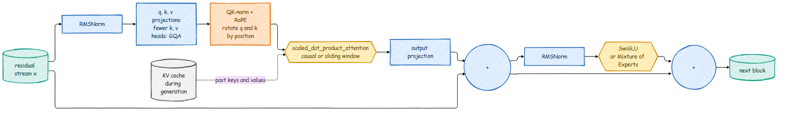
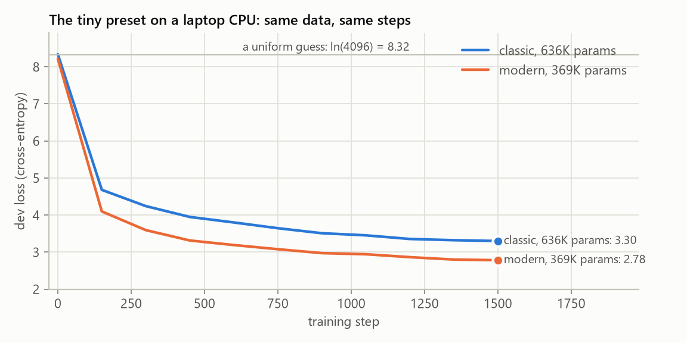

# The Modern Model: From the 2017 Transformer to a 2026 LLM

The model in `src/models/` is the Transformer from [Attention Is All You Need](https://arxiv.org/abs/1706.03762),
in its GPT-2 form: learned position embeddings, LayerNorm, a ReLU MLP, and attention written
out by hand. It is the best model to learn from, and it is the one the README builds line by
line.

Every large open model released since 2023 (Llama 3 and 4, Qwen 3, Gemma 3, Mistral,
DeepSeek-V3, OLMo 2, GPT-OSS) keeps the same skeleton, a stack of pre-norm residual blocks
with attention and an MLP, but replaces almost every part inside the block. `src/models/modern/`
implements those replacements, one small file per idea, and the whole repo can train either
model: pretraining, SFT, the reward model, DPO, PPO, GRPO, chat and evaluation.



## What changed, and why

| Part | Classic (`src/models/`) | Modern (`src/models/modern/`) | Why it changed | Used by |
|---|---|---|---|---|
| Positions | learned table, added to the embeddings | [rotary embeddings](rope.md) inside attention | relative positions, no parameters to learn | Llama, Qwen, Gemma, DeepSeek |
| Normalization | LayerNorm | [RMSNorm](blocks.md#rmsnorm) | cheaper, same quality | all of the above |
| MLP | ReLU, 4x wide | [SwiGLU](blocks.md#swiglu), 8/3x wide | lower loss for the same parameters | Llama, Qwen, Mistral, DeepSeek |
| Key/value heads | one per query head | [grouped-query](attention.md#grouped-query-attention) or [latent](attention.md#multi-head-latent-attention) | a much smaller KV cache | Llama 3, Qwen 3 (GQA), DeepSeek-V3 (MLA) |
| Attention kernel | explicit softmax, stored mask | `F.scaled_dot_product_attention` | FlashAttention: no T x T matrix in memory | everyone |
| Attention stability | nothing | [QK-norm](attention.md#qk-norm-and-gated-attention) | bounded attention logits | OLMo 2, Qwen 3, Gemma 3 |
| Output layer | its own matrix | [tied](blocks.md#tied-embeddings) to the input embedding | saves vocab x n_embed parameters | Gemma, small Llama and Qwen |
| MLP sparsity | dense | optional [Mixture of Experts](moe.md) | more parameters, same compute per token | Mixtral, DeepSeek, Qwen 3 MoE, GPT-OSS |
| Long context | full attention | optional [sliding window](attention.md#sliding-window-attention) | attention cost grows with the window, not the text | Mistral, Gemma 3, GPT-OSS |
| Generation | re-run the whole prefix | [KV cache](attention.md#the-kv-cache-and-why-it-dominates-memory) | O(n) instead of O(n^2) work | everyone |
| Biases | in every linear layer | none | fewer parameters, no quality loss | Llama, Qwen, Mistral |
| Initialization | PyTorch defaults | [small, depth-scaled](blocks.md#initialization) | the residual stream does not grow with depth | GPT-2 onward |

## Use it

Every training script takes the same switch:

```bash
# a laptop-sized run (see the student guide)
python scripts/train_transformer.py --preset tiny --arch modern

# the scalable pretraining script, with grouped-query attention and the Muon optimizer
python scripts/pretrain_base.py --arch modern --n_kv_head 4 --optimizer muon --lr_schedule wsd

# a Mixture-of-Experts model with DeepSeek-style latent attention
python scripts/pretrain_base.py --arch modern --attention mla --n_experts 8 --moe_top_k 2
```

For the post-training stages, set `"arch": "modern"` (and any of the settings below) in
`configs/base.json`, so every stage builds the same model. Checkpoints remember their
architecture, so `chat.py`, `eval_post_training.py` and `generate_text.py` load them without
any flag.

| Setting | Default | Meaning |
|---|---|---|
| `arch` | `classic` | `modern` switches to `src/models/modern` |
| `n_kv_head` | `null` (= `n_head`) | key/value heads; 1 is multi-query attention |
| `attention` | `gqa` | `mla` is DeepSeek's multi-head latent attention |
| `kv_latent_dim` | `null` (= n_embed / 4) | size of the cached MLA latent |
| `rope_theta` | `10000` | base of the rotary frequencies |
| `qk_norm` | `true` | RMSNorm on queries and keys |
| `attn_gate` | `false` | sigmoid gate on each head's output |
| `sliding_window` | `null` | attend only to the last N tokens |
| `tie_embeddings` | `true` | output layer shares the embedding matrix |
| `n_experts` | `0` | > 0 replaces the MLP with a Mixture of Experts |
| `moe_top_k`, `n_shared_experts` | `2`, `0` | experts per token, always-on experts |

## Read the code in this order

Each file is short and starts with a docstring that explains the idea before the code:

1. [`norm.py`](https://github.com/FareedKhan-dev/train-llm-from-scratch/blob/main/src/models/modern/norm.py): RMSNorm.
2. [`rope.py`](https://github.com/FareedKhan-dev/train-llm-from-scratch/blob/main/src/models/modern/rope.py): rotary position embeddings.
3. [`mlp.py`](https://github.com/FareedKhan-dev/train-llm-from-scratch/blob/main/src/models/modern/mlp.py): SwiGLU.
4. [`attention.py`](https://github.com/FareedKhan-dev/train-llm-from-scratch/blob/main/src/models/modern/attention.py): GQA, MLA, sliding windows, the causal mask with a cache.
5. [`kv_cache.py`](https://github.com/FareedKhan-dev/train-llm-from-scratch/blob/main/src/models/modern/kv_cache.py): the key/value cache.
6. [`moe.py`](https://github.com/FareedKhan-dev/train-llm-from-scratch/blob/main/src/models/modern/moe.py): Mixture of Experts.
7. [`block.py`](https://github.com/FareedKhan-dev/train-llm-from-scratch/blob/main/src/models/modern/block.py) and [`model.py`](https://github.com/FareedKhan-dev/train-llm-from-scratch/blob/main/src/models/modern/model.py): putting it together, generation, FLOP counting.

`tests/test_modern_model.py` checks the properties that must hold for every variant: a
changed token never changes earlier predictions (causality), decoding with the KV cache
gives the same logits as a full forward pass, rotary scores depend only on relative
position, and grouped-query attention equals multi-head attention with copied heads.

## Does it help? A small, honest comparison

Both architectures, same data (TinyStories, 4096-token BPE), same tiny preset (2 blocks,
64 dimensions, 4 heads, 128-token windows, 1500 steps, batch 32), trained on a laptop CPU:

| Architecture | Parameters | Dev loss after 1500 steps |
|---|---:|---:|
| classic | 636K | 3.30 |
| modern | 369K | 2.78 |

The modern model has 42% fewer parameters (the tied output layer and no position table)
and still reaches a lower loss, in less time.



One seed at a tiny scale is a sanity check, not a benchmark, and this comparison does not
say which change helped most. GQA, MLA, MoE and sliding windows are not expected to help
here at all: they save memory and compute at larger scales, which the pages below explain
with numbers.

## The pages in this section

The architecture:

- [Building blocks: RMSNorm, SwiGLU, tied embeddings, initialization](blocks.md)
- [Rotary position embeddings](rope.md)
- [Attention: GQA, MLA, QK-norm, sliding windows and the KV cache](attention.md)
- [Mixture of Experts](moe.md)

Training and using it:

- [Optimizers and schedules: AdamW, Muon, WSD](optimizers.md)
- [Preference optimization: DPO, IPO, SimPO, ORPO and KTO](preference.md)
- [RL for reasoning: GRPO, Dr. GRPO, DAPO and GSPO](rl_reasoning.md)
- [LoRA](lora.md)
- [Inference: sampling, the KV cache, speculative decoding and int8](inference.md)
