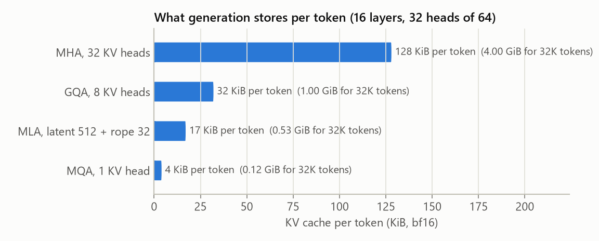
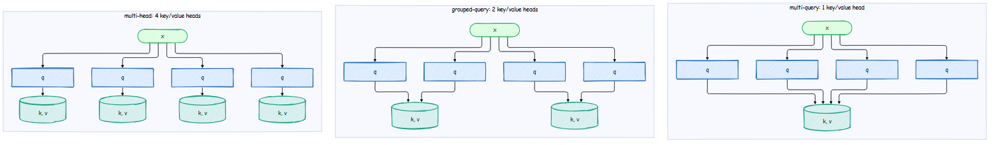
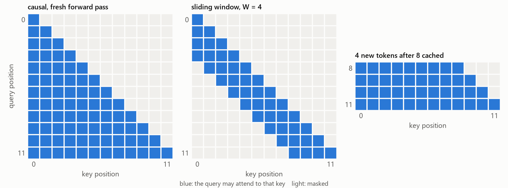

# Attention: GQA, MLA, QK-norm, Sliding Windows and the KV Cache

The classic model computes attention exactly as the paper writes it: one small module per
head, the `(T x T)` score matrix in memory, a stored triangular mask, an explicit softmax.
The modern model computes the same function, organized for memory: fewer key/value heads,
a cache for generation, and a fused kernel.

## The KV cache, and why it dominates memory

When a model generates, the keys and values of earlier tokens never change (attention is
causal), so there is no need to recompute them. A *KV cache* stores them; each new token
only computes its own query, key and value, and attends to the stored ones. Generation goes
from O(n^2) to O(n) work.


The price is memory. For every token, every layer stores one key and one value vector per
key/value head:

$$
\text{bytes per token} = 2 \times n_{\text{layers}} \times n_{\text{kv\_heads}} \times d_{\text{head}} \times \text{bytes per number}
$$

For a Llama-3-8B-sized model (32 layers, 128-dimensional heads, bf16) with one key/value
head per query head (32), that is 512 KB per token: a single 128K-token conversation needs
64 GB of cache, more than the model itself. This, not the weights, is what limits batch
size and context length when serving an LLM. The rest of this page is about shrinking it.



The plot is computed from the formula, for a 1B-parameter-class config (16 layers, 32 query
heads of size 64, bf16).

## Grouped-query attention

[GQA](https://arxiv.org/abs/2305.13245) lets several query heads share one key/value head.
With `n_head = 32` and `n_kv_head = 8`, every group of 4 query heads reads the same keys and
values, and the cache is 4x smaller. `n_kv_head = 1` is *multi-query attention* (MQA), the
extreme case; `n_kv_head = n_head` is ordinary multi-head attention.



```python
k = self.k_proj(x).view(B, T, Hkv, D).transpose(1, 2)    # only Hkv key heads are computed and cached
v = self.v_proj(x).view(B, T, Hkv, D).transpose(1, 2)
...
if Hkv != H:                                             # each group of H // Hkv query heads
    k = k.repeat_interleave(H // Hkv, dim=1)             # reads the same key/value head
    v = v.repeat_interleave(H // Hkv, dim=1)
```

The quality cost is small (Llama 2 70B, Llama 3 and Qwen 3 all use GQA). One way to see that
nothing magic happens: `test_gqa_equals_mha_with_shared_heads` builds a GQA layer and an MHA
layer whose key/value weights are copies of the GQA groups, and checks they give the same
output.

## Multi-head latent attention

[DeepSeek-V2](https://arxiv.org/abs/2405.04434) went further. Instead of caching keys and
values, cache one small *latent* vector per token, and rebuild every head's key and value
from it with two linear maps:

$$
c_t = W_{\text{down}}\, x_t, \qquad k_t^{(h)} = W_{\text{uk}}^{(h)}\, c_t, \qquad v_t^{(h)} = W_{\text{uv}}^{(h)}\, c_t
$$

There is a catch: a rotated key can no longer be rebuilt from the latent, because the rotation
depends on the position and the up-projection does not. MLA's fix is to split each head in
two: a "content" part that comes from the latent and carries no position, and a small
"position" part (`rope_dim` numbers) that carries RoPE, with one rotated key shared by all
heads. The cache holds the latent plus that one shared key:

| Attention | Numbers cached per token per layer | Example (32 heads of 128) |
|---|---|---:|
| MHA | `2 * n_head * head_dim` | 8192 |
| GQA, 8 KV heads | `2 * n_kv_head * head_dim` | 2048 |
| MQA | `2 * head_dim` | 256 |
| MLA (DeepSeek-V3: latent 512, rope 64) | `latent + rope_dim` | 576 |

MLA keeps the quality of full multi-head attention (every head still has its own keys and
values) at roughly the cache cost of MQA. Our `MultiHeadLatentAttention` keeps the
up-projections explicit so the idea stays visible; production code folds `W_uk` into the
query projection at inference time so the full keys are never materialized.

```bash
python scripts/pretrain_base.py --arch modern --attention mla --kv_latent_dim 256
```

## QK-norm and gated attention

Attention logits are dot products of queries and keys. If their norms drift up during
training, the softmax saturates (one key gets all the weight) and gradients vanish; this is
one of the classic causes of loss spikes in large runs. *QK-norm* applies RMSNorm to every
query and key head before the dot product, which bounds the logits. OLMo 2, Qwen 3 and
Gemma 3 use it. It is on by default here (`qk_norm`).

*Gated attention* ([Qwen team, 2025](https://arxiv.org/abs/2505.06708), used in Qwen3-Next)
multiplies each head's output by a sigmoid gate computed from the input. A head can then
output "nothing" when it has nothing useful, instead of being forced to spread attention
somewhere (the "attention sink" effect). Turn it on with `attn_gate: true`.

## Sliding-window attention

With a window `W`, token `t` attends only to tokens `t - W + 1 .. t`. The cost of attention
then grows with the window instead of the whole text, and the cache can drop tokens older
than the window. Information still travels further than `W`: with `L` layers, layer by layer,
the receptive field grows to about `L * W` tokens. Mistral 7B used it in every layer; Gemma 3
uses five windowed layers for every full-attention layer, and GPT-OSS alternates the two.



## The mask with a cache: a subtle pitfall

`F.scaled_dot_product_attention(..., is_causal=True)` builds a triangular mask aligned to
the *top-left* corner: query `i` may see keys `0..i`. That is right for a fresh forward
pass, where queries and keys are the same positions. With a cache, the queries are the last
`T` positions and the keys are all `start + T` positions, so query `i` is really at position
`start + i` and must see keys `0..start + i`. The top-left mask would hide almost the whole
cache. `attention_mask()` builds the right mask from absolute positions:

```python
q_pos = torch.arange(start, start + q_len)[:, None]       # where the queries really are
k_pos = torch.arange(k_len)[None, :]
allowed = k_pos <= q_pos                                   # causal
if window is not None:
    allowed &= k_pos > q_pos - window                      # sliding window
```

and skips the mask tensor in the two common cases: a fresh pass uses the fast
`is_causal=True` path, and a single new token with a cache may see every cached key.
`test_kv_cache_matches_full_forward` decodes token by token with the cache and checks the
logits against a full forward pass, for every attention variant.

## FlashAttention for free

`F.scaled_dot_product_attention` picks the fastest available kernel. On recent NVIDIA GPUs
that is FlashAttention, which never stores the `(T x T)` score matrix: it streams blocks of
keys through fast on-chip memory and keeps a running softmax. Memory for attention becomes
linear in the sequence length. The classic model, which builds the full matrix in every
head, needs `batch x heads x T x T` floats per layer just for the scores.
