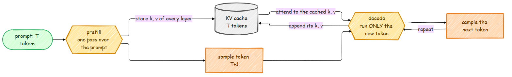
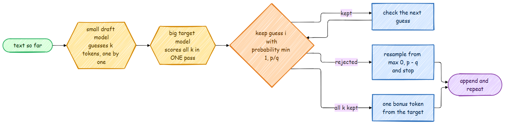

# Inference: Sampling, the KV Cache, Speculative Decoding and int8

Training ends with a checkpoint. This page is about turning it into text quickly and cheaply:
how a token is picked, how the KV cache avoids repeated work, how a small model can speed up a
big one without changing its output, and how to store the linear layers in a quarter of the memory.
Everything here works from one script:

```bash
python scripts/generate_text.py --model_path models/student.pt                      # sampling
python scripts/generate_text.py --model_path models/student.pt --top_k 0 --min_p 0.05
python scripts/generate_text.py --model_path models/student.pt --draft_model models/tiny.pt
python scripts/generate_text.py --model_path models/student.pt --int8
```

## Picking the next token

The model gives a score (logit) for every token in the vocabulary. Turning those scores into
one token is a choice, and `src/inference/sampling.py` applies the usual knobs in order:

| Knob | What it does | Typical value |
|---|---|---|
| `temperature` | divides the logits: below 1 sharpens the distribution, above 1 flattens it | 0.7 to 1.0 |
| `top_k` | keeps the `k` most likely tokens | 40 to 100 |
| `top_p` | keeps the most likely tokens until their probabilities add up to `p` | 0.9 to 0.95 |
| `min_p` | keeps tokens at least `min_p` times as likely as the top token | 0.05 to 0.1 |
| greedy | always takes the most likely token | for evaluation |

[min-p sampling](https://arxiv.org/abs/2407.01082) is the newest of these. Top-p keeps a fixed
amount of probability mass, so when the model is unsure it can let in a long tail of bad
tokens, and when it is sure it may still keep a few. Min-p scales its cutoff with the model's
confidence:

$$
\text{keep token } i \iff p_i \ge \text{min\_p} \cdot \max_j p_j
$$

```python
if min_p is not None and 0.0 < min_p < 1.0:
    probs = logits.softmax(dim=-1)
    threshold = min_p * probs.max(dim=-1, keepdim=True).values
    logits = logits.masked_fill(probs < threshold, float("-inf"))
```

When the top token has probability 0.9, min-p 0.1 keeps only tokens above 0.09. When the top
token has 0.05, it keeps everything above 0.005, which may be dozens of reasonable choices.
Both models and both generation paths share this code. [Generation & Sampling](../foundations/generation.md)
covers the basics.

## Prefill and decode with the KV cache



The classic model's `generate` is the textbook loop: run the whole window through the model,
keep the last row of logits, sample, append, repeat. Every step recomputes the keys and values
of every earlier token, although they never change.

The modern model's `generate` uses the KV cache (`src/models/modern/kv_cache.py`) and works in
two phases:

1. **Prefill**: one forward pass over the prompt fills the cache with every layer's keys and
   values.
2. **Decode**: each new token runs through the model alone, attends to the cache, and appends
   its own key and value.

```python
cache = self.new_cache(idx.size(0))
hidden = self.forward_hidden(idx[:, -window:], cache)        # prefill
for _ in range(max_new_tokens):
    logits = self.lm_head(hidden[:, -1, :])
    next_token = sample_next_token(logits, temperature, top_k, top_p, min_p)
    idx = torch.cat([idx, next_token], dim=1)
    if cache.length >= window:                                # out of room: keep the latest half
        cache.reset()
        hidden = self.forward_hidden(idx[:, -(window // 2):], cache)
    else:
        hidden = self.forward_hidden(next_token, cache)        # decode one token
```

When the cache is full, the model keeps the most recent half of the text and prefills it
again. Positions restart from 0, so they stay inside the range the model was trained on and
the rotary tables cover, at the price of one extra pass every `window / 2` tokens.
`test_kv_cache_matches_full_forward`
and `test_cached_and_uncached_generation_agree` check that cached decoding gives the same
logits as recomputing everything.

How much this saves depends on the length. Without the cache, token `n` costs a forward pass
over `n` tokens; with it, a pass over one token plus attention to `n` cached ones. For a long
generation that is the difference between quadratic and linear total work. On a laptop CPU, a
student-sized model (2.6M parameters) generated 240 tokens at about 65 tokens per second
without the cache and 130 to 180 with it, with exactly the same output, and the gap grows with
the length of the text.

The PPO and GRPO rollouts, the GSM8K evaluation and `chat.py` all generate through
`generate_with_logprobs` (`src/post_training/rollout.py`), which uses the same cache when the
model is the modern one. That matters most for RL, where rollouts are most of the training
cost. With a student-sized model on a laptop CPU, 8 prompts of 32 tokens with 160 new
tokens each took 2.4 seconds with the cache and 13.5 without it.

## Speculative decoding



Generating with a big model is slow because each token needs a full forward pass and the
passes cannot overlap. But checking several tokens costs about the same as generating one: a
forward pass over `k` tokens reads the weights once, and on a GPU reading the weights is most
of the cost. Speculative decoding ([Leviathan et al., 2023](https://arxiv.org/abs/2211.17192);
[Chen et al., 2023](https://arxiv.org/abs/2302.01318)) exploits that:

1. A small **draft** model guesses the next `k` tokens, one at a time (cheap).
2. The big **target** model scores all `k` guesses in one forward pass.
3. Each guess `x` is kept with probability `min(1, p(x) / q(x))`, where `p` is the target's
   probability and `q` the draft's. At the first rejection, a replacement is sampled from
   `max(0, p - q)`, renormalized. If all `k` are kept, the target's last row gives one bonus
   token for free.

The surprising part is that the output follows the target's distribution *exactly*, however
bad the draft is. For one position, a token `x` comes out either because the draft proposed it
and it was kept, or because a rejection resampled it:

$$
P(x) = q(x)\min\Big(1, \tfrac{p(x)}{q(x)}\Big) + \Big(1 - \sum_y \min(p(y), q(y))\Big)\frac{\max(0,\, p(x) - q(x))}{\sum_y \max(0,\, p(y) - q(y))}
$$

The first term is `min(p(x), q(x))`. In the second, `1 - sum min(p, q)` equals
`sum max(0, p - q)` (both are the total amount by which `p` exceeds `q`), so the fraction
cancels and leaves `max(0, p(x) - q(x))`. The two add up to `p(x)`. A good draft only changes
how many tokens each target pass produces. `test_sampling_keeps_the_target_distribution_whatever_the_draft`
checks this by sampling 3,000 times with a deliberately different draft. With greedy decoding
the rule becomes "keep a guess if it is the target's top token", so the output is identical to
plain greedy decoding with the target, which `test_greedy_speculative_decoding_equals_greedy_target_decoding`
checks.

```python
from src.inference.speculative import speculative_generate

out, stats = speculative_generate(target, draft, prompt_ids, max_new_tokens=200, k=4, temperature=0.8)
print(stats.acceptance_rate, stats.tokens_per_target_call)
```

The draft must use the same tokenizer as the target. In the student track that comes for free:
the `tiny` and `student` presets share the BPE trained by `prepare_tiny_data.py`.

Measured with the two tiny models, which share a tokenizer: the classic one (636K parameters)
as the target and the modern one (369K) as the draft, on 10 prompts with 100 new tokens each
and `k = 4`:

| Decoding | Guesses kept | Tokens per target pass | Target passes for 1,000 tokens |
|---|---:|---:|---:|
| greedy | 38% | 2.48 | 403 |
| sampling, temperature 0.8 | 35% | 2.35 | 426 |

The target ran 403 times instead of 1,000 for the same greedy text. The wall-clock time still
got worse, 7.5 seconds against 4.1: this "small" draft costs as much per token as the target,
because most of both models is the same 4096-row output layer, so 403 target passes plus 1,587
draft passes take longer than 1,000 target passes. Speculative decoding pays off when the draft
is far cheaper than the target (a 1B draft for a 70B target, say) and on GPUs, where checking
`k` tokens costs about the same as generating one. Try it with your own pair:

```bash
python scripts/generate_text.py --model_path models/student.pt --draft_model models/tiny.pt --draft_k 4
```

This implementation recomputes the prefix on each call instead of keeping a KV cache for both
models, to keep the algorithm in plain view. It counts target passes, which is what the
speedup comes from on a GPU, rather than racing the cached `generate` on wall-clock time.

## int8 weights

A float32 weight takes 4 bytes; an int8 takes 1. Weight-only quantization
(`src/inference/quantize.py`) stores every `nn.Linear` weight as int8 plus one float scale per
output row:

$$
s_r = \frac{\max_j |W_{rj}|}{127}, \qquad Q_r = \text{round}\Big(\frac{W_r}{s_r}\Big), \qquad W_r \approx s_r\, Q_r
$$

```python
class Int8Linear(nn.Module):
    def __init__(self, linear):
        w = linear.weight.detach().float()
        scale = w.abs().amax(dim=1, keepdim=True).clamp(min=1e-8) / 127.0     # one scale per output row
        self.register_buffer("weight_int8", torch.round(w / scale).clamp(-127, 127).to(torch.int8))
        self.register_buffer("scale", scale)

    def forward(self, x):
        return F.linear(x, (self.weight_int8.float() * self.scale).to(x.dtype), self.bias)
```

One scale per row ("per channel") matters: a single scale for the whole matrix would let one
large weight squeeze every other row into a few integer levels. The matrix multiply still runs
in floating point, so this saves memory, not arithmetic. That is the right trade for
generation, where each token reads every weight once and memory bandwidth, not compute, sets
the speed.

Measured on the trained tiny models, on 16 windows of held-out TinyStories text:

| Model | Checkpoint size | Logit cosine similarity | Same top token | Held-out loss |
|---|---|---:|---:|---|
| tiny classic | 2.55 MB to 2.26 MB | 0.99999 | 99.5% | 3.362 to 3.362 |
| tiny modern | 1.48 MB to 1.16 MB | 0.99998 | 99.0% | 2.818 to 2.818 |

The loss does not move in the third decimal. The size barely moves either, because in tiny
models most of the weights are the embedding table, which is a lookup and stays in float. At a
realistic size the linear layers dominate. For the ~400M-parameter `configs/base.json` model:

| Architecture | Parameters | Checkpoint size |
|---|---:|---|
| classic | 406M | 1.51 GiB to 0.67 GiB (2.3x smaller) |
| modern | 355M | 1.32 GiB to 0.48 GiB (2.8x smaller) |

The output layer is left in float by default (`skip=("lm_head",)`): in the modern model it is
the same matrix as the input embedding, and quantizing it would quietly untie the two. The
classic model gains less because its untied output layer and position table stay in float.

int8 weight-only is the simplest member of a big family. Going further means 4-bit weights
with groups of 32 to 128 values sharing a scale (GPTQ, AWQ), or quantizing activations too so
the matrix multiply itself runs in int8 or fp8.
