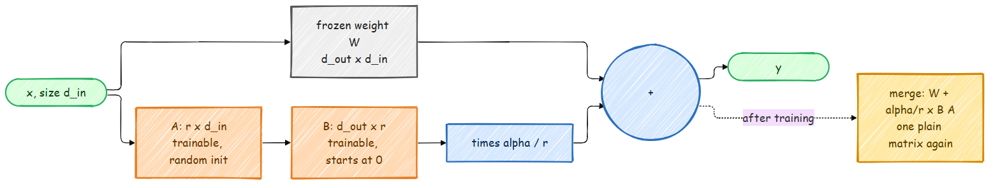

# LoRA: Fine-Tuning a Few Million Numbers Instead of Billions

Full fine-tuning updates every weight. With Adam, every trainable number also needs two
optimizer states and a gradient, so fine-tuning a model costs about four times its size in
memory. [LoRA](https://arxiv.org/abs/2106.09685) freezes the model and learns a small
low-rank correction for some of its weight matrices instead.



## The idea

Take a frozen weight matrix `W` (`d_out x d_in`). LoRA adds two thin trainable matrices,
`A` (`r x d_in`) and `B` (`d_out x r`), with a small rank `r`:

$$
y = W x + \frac{\alpha}{r}\, B A\, x
$$

With `d = 1024` and `r = 8`, a full matrix has 1M numbers and the LoRA pair has 16K. Two
details make it work well:

- `B` starts at **zero**, so at step 0 the model is exactly the pretrained model, and
  training starts from where pretraining left off.
- `alpha / r` keeps the update scale steady when you change `r`, so a learning rate that
  works at one rank works at another.

After training, the correction folds back into the weight, `W' = W + (alpha / r) B A`, and the
model is a plain model again: no extra layers, no extra cost at inference.

## The code

`src/models/lora.py` is short enough to read in one go:

```python
class LoRALinear(nn.Module):
    def __init__(self, base: nn.Linear, rank: int, alpha: float = 16.0, dropout: float = 0.0):
        super().__init__()
        self.base = base                                  # frozen
        self.scaling = alpha / rank
        self.lora_A = nn.Parameter(torch.empty(rank, base.in_features))
        self.lora_B = nn.Parameter(torch.zeros(base.out_features, rank))
        nn.init.kaiming_uniform_(self.lora_A, a=math.sqrt(5))

    def forward(self, x):
        return self.base(x) + (self.dropout(x) @ self.lora_A.T) @ self.lora_B.T * self.scaling
```

`apply_lora(model, rank)` freezes everything and wraps the attention projections of either
architecture (`query`/`key`/`value`/`proj` in the classic model, where the MLP's output layer
is also called `proj` and gets wrapped too; `q_proj`/`k_proj`/`v_proj`/`o_proj` in the modern
one); `merge_lora(model)` folds the updates back in.

## In the SFT stage

```bash
python scripts/train_sft.py --lora_rank 16 --lora_alpha 32
```

prints how small the trainable part is. For the default ~400M base (24 blocks of 1024
dimensions), measured with both architectures:

```text
modern:  LoRA rank 16 on 96 layers: training 3,145,728 of 358,273,024 parameters (0.88%)
classic: LoRA rank 16 on 1200 layers: training 22,806,528 of 429,165,696 parameters (5.31%)
```

The difference is a nice lesson in how layout matters. The modern model has one fused
`q_proj`, `k_proj`, `v_proj` and `o_proj` per block, 4 matrices to adapt. The classic model
gives every head its own `query`, `key` and `value` layer, 48 per block, and each of them
reads the full 1024-dimensional input, so each gets its own `16 x 1024` matrix `A`. Add the two
layers named `proj` (attention output and MLP output) and the classic model trains about seven
times more adapter weights for the same rank.

Checkpoints are saved with the adapters merged, so the reward model, DPO, PPO and GRPO load
an SFT-with-LoRA checkpoint exactly like a fully fine-tuned one.

The tests check the three properties that matter: the wrapped model gives the same output
as the original at step 0, merging changes nothing about the outputs, and the frozen base
weights really stay frozen while the adapters learn.

## When to use it

- **Memory.** Optimizer state shrinks with the trainable count, so a model that does not
  fit for full fine-tuning often fits with LoRA.
- **Many variants of one model.** Each fine-tune is a small file of adapters.
- **Less forgetting.** A low-rank update cannot move the model as far, which also limits
  how much it learns. For big domain shifts, full fine-tuning still wins.
