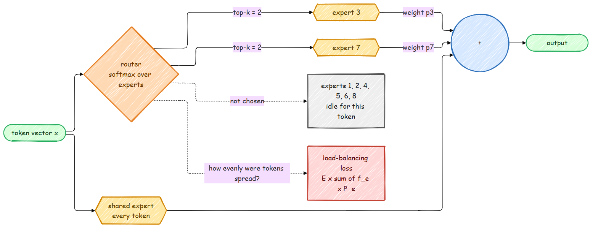

# Mixture of Experts

A dense model runs every parameter for every token. A Mixture-of-Experts (MoE) layer holds
many feed-forward blocks, the *experts*, and sends each token to only a few of them. The
model can then have far more parameters (more knowledge) while each token costs about the
same compute as a dense model. DeepSeek-V3 has 671B parameters but activates 37B per token;
Mixtral, Qwen 3 MoE and GPT-OSS work the same way.



## Routing

For each token `x`, a small linear *router* scores all `E` experts, and a softmax turns the
scores into probabilities. The token goes to its `k` most likely experts, and their outputs
are mixed with those probabilities, renormalized over the chosen ones:

$$
p = \text{softmax}(W_r\, x), \qquad
y = \sum_{e \in \text{top-}k(p)} \frac{p_e}{\sum_{j \in \text{top-}k(p)} p_j}\; \text{Expert}_e(x)
$$

```python
probs = F.softmax(self.router(flat).float(), dim=-1)        # (tokens, experts)
weights, chosen = probs.topk(self.top_k, dim=-1)              # (tokens, k)
weights = weights / weights.sum(dim=-1, keepdim=True)

out = torch.zeros_like(flat)
for e, expert in enumerate(self.experts):
    token_idx, slot = torch.where(chosen == e)                # which tokens picked expert e
    if token_idx.numel():
        out.index_add_(0, token_idx, expert(flat[token_idx]) * weights[token_idx, slot, None])
```

The loop over experts is the clearest way to write it. Production code sorts tokens by expert
and runs one grouped matrix multiply, and spreads experts over GPUs (expert parallelism), but
the math is the same.

## Keeping the experts busy: the balancing loss

If nothing pushes back, a few experts win early, get all the tokens, improve faster, and win
even more; the other experts never learn. The [Switch Transformer](https://arxiv.org/abs/2101.03961)
fix is an auxiliary loss that is smallest when routing is uniform:

$$
\mathcal{L}_{\text{aux}} = E \sum_{e=1}^{E} f_e \, P_e
$$

`f_e` is the fraction of routing slots that went to expert `e` (counted, not differentiable)
and `P_e` is the average router probability for `e` (differentiable). With perfectly even
routing both are `1/E` and the loss is 1; as routing piles onto a few experts it grows, up to
`E / k`. The model adds `moe_aux_loss_coef * aux` (0.01 by default) to the language-modeling
loss, averaged over the MoE layers. `tests/test_modern_model.py` checks that the gradient of
this loss reaches the router.

Pretraining and SFT add this loss (`moe_balance_loss()` in `src/post_training/utils.py`). The
preference and RL stages, which move the model much less, do not, like most fine-tuning
setups; watch `tokens_per_expert` if you run them for long on an MoE model.

DeepSeek-V3 replaced this loss with a per-expert bias that is nudged up or down after each
step depending on the expert's load, which balances without pulling on the main objective.
It is a nice extension exercise.

## Shared experts

[DeepSeekMoE](https://arxiv.org/abs/2401.06066) adds one or more *shared* experts that every
token goes through. They hold the common knowledge every token needs, so the routed experts
are free to specialize. Set `n_shared_experts: 1` to try it.

## Parameters vs compute

`ModernTransformer.num_params()` counts everything; `active_params()` counts only what one
token uses (the shared parts plus `k` routed experts per layer):

```python
from src.models.modern import ModernConfig, ModernTransformer
cfg = ModernConfig(n_embed=512, n_head=8, n_blocks=8, n_experts=8, moe_top_k=2)
model = ModernTransformer(cfg)
print(f"{model.num_params()/1e6:.0f}M total, {model.active_params()/1e6:.0f}M active per token")
# 173M total, 69M active per token
```

Training FLOPs follow the active count (`flops_per_token()` uses it). Memory follows the
total count: every expert must be stored, and with Adam each parameter costs about 16 bytes
during training. That is the MoE trade: more memory for the same compute.

## Try it

```bash
python scripts/pretrain_base.py --arch modern --n_experts 8 --moe_top_k 2 --n_shared_experts 1
```

With MoE, the router probabilities and expert loads are worth logging. `MoE.tokens_per_expert`
holds the counts from the last forward pass of each layer; a healthy run keeps them close to
`tokens * k / E`.
