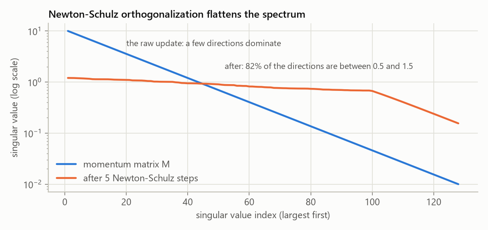
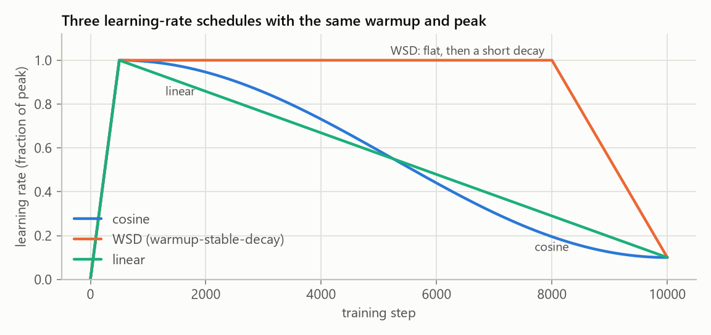

# Optimizers and Schedules: AdamW, Muon, WSD

Two choices decide how fast a model learns from the same data: how each gradient becomes an
update (the optimizer), and how big the steps are over time (the learning-rate schedule).
The repo has AdamW and Muon, and cosine, WSD and linear schedules, all written out in
`src/optim/`.

## AdamW, briefly

AdamW keeps two running averages per number: the gradient `m` and the squared gradient `v`,
and steps along `m / sqrt(v)`. Every weight gets its own step size. Weight decay is applied
directly to the weights ("decoupled"), not through the gradient:

$$
m \leftarrow \beta_1 m + (1-\beta_1) g, \quad
v \leftarrow \beta_2 v + (1-\beta_2) g^2, \quad
w \leftarrow w - \eta\Big(\frac{\hat m}{\sqrt{\hat v} + \epsilon} + \lambda w\Big)
$$

The standard GPT recipe decays only the weight matrices, never biases or norm scales; that
split is `adamw_param_groups()`.

## Muon

AdamW treats a weight matrix as a bag of unrelated numbers. [Muon](https://kellerjordan.github.io/posts/muon/)
treats it as a matrix. It keeps an ordinary momentum `M` of the gradient, but instead of
stepping along `M` it steps along the closest *orthogonal* matrix: if `M = U S V^T`, the
update is `U V^T`, which has every singular value equal to 1. Every direction the gradient
points in gets the same step size, so useful but rare directions are not drowned out by the
few that dominate the gradient.

An SVD every step would be too slow, so Muon runs five iterations of a quintic Newton-Schulz
map, a few matrix multiplications that push all singular values toward 1:

$$
X \leftarrow a X + b (X X^\top) X + c (X X^\top)^2 X, \qquad (a, b, c) = (3.4445, -4.7750, 2.0315)
$$



```python
def newton_schulz(G, steps=5, eps=1e-7, coefficients=(3.4445, -4.7750, 2.0315), dtype=torch.bfloat16):
    a, b, c = coefficients
    X = G.to(dtype)
    transposed = G.size(0) > G.size(1)
    if transposed:
        X = X.T
    X = X / X.norm().clamp(min=eps)          # the Frobenius norm bounds the spectral norm
    for _ in range(steps):
        A = X @ X.T
        X = a * X + (b * A + c * (A @ A)) @ X
    return X.T if transposed else X
```

The coefficients are chosen to push small singular values up as fast as possible, at the
cost of not converging exactly. In the plot, 82% of the directions end up between 0.5 and
1.5 instead of exactly 1, and the very smallest stay small after only five steps. Neither
hurts training: what matters is that the few dominant directions no longer swamp the rest.

Muon only makes sense for the 2D hidden matrices. Embeddings, the output layer, norm scales
and biases keep using AdamW; `muon_param_groups()` makes that split, and our `Muon` class runs
both kinds of groups so it drops into any training loop.

How big should a Muon step be? [Moonshot's scaling study](https://arxiv.org/abs/2502.16982)
rescales each update to the typical size of an AdamW update (`0.2 * sqrt(max(rows, cols))`),
so the *same* learning rate and weight decay work for both parameter groups. That is the
default here (`adjust_lr="match_rms_adamw"`), so Muon reuses every learning-rate schedule
unchanged:

```bash
python scripts/pretrain_base.py --optimizer muon
```

Muon set records in the nanoGPT speedrun and was scaled to a 1-trillion-parameter model
(Kimi K2). `tests/test_optim.py` checks our version against `torch.optim.Muon` (PyTorch 2.9+)
and the AdamW groups against `torch.optim.AdamW`.

## Learning-rate schedules



Every schedule starts with a linear **warmup**: at step 0 Adam's second-moment estimate is
based on a single gradient, and a full-size step from it can damage a fresh model.

- **Cosine** (GPT-3, Llama 2): after warmup, follow half a cosine down to `min_lr`. The
  schedule needs the total number of steps up front, and a checkpoint from the middle of the
  run is not "finished": its learning rate is still high.
- **WSD**, warmup-stable-decay ([MiniCPM](https://arxiv.org/abs/2404.06395), DeepSeek, OLMo 2):
  stay at the peak rate for most of training, then decay quickly over the last 10 to 20%.
  The practical win: you can take any checkpoint from the stable phase, run the short decay,
  and get a finished model, so the training length does not have to be fixed in advance.
  The loss drops sharply during the decay, which is normal.
- **Linear** to zero: a straight line from the peak down to `min_lr`. [Bergsma et al., 2025](https://arxiv.org/abs/2502.15938)
  found that decaying linearly all the way to zero matches or beats cosine at LLM scale.

```bash
python scripts/pretrain_base.py --lr_schedule wsd
python scripts/pretrain_base.py --lr_schedule linear --min_lr 0
```

The original `train_transformer.py` uses a step decay (one 10x drop at `t_lr_decay_step`,
80% of the way through in the presets), which is WSD with an instant decay.
