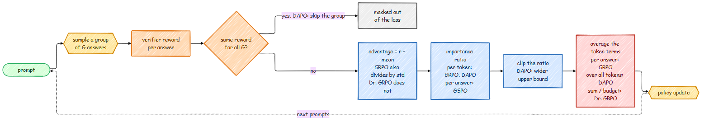

# RL for Reasoning: GRPO, Dr. GRPO, DAPO and GSPO

GRPO ([DeepSeekMath, 2024](https://arxiv.org/abs/2402.03300)) made reinforcement learning on
verifiable rewards practical: sample a group of answers per prompt, check each one (did the
final number match?), and push up the answers that beat their group. No reward model and no
value network. In 2025 several groups took it apart and found biases in its details. Each
fix is a flag in `scripts/train_grpo.py`, and the defaults reproduce the original behavior
of this repo.

## GRPO in one paragraph

For a prompt, sample `G` answers and score them: rewards `r_1 .. r_G`. The advantage of answer
`i` is how much better it did than its group, `A_i = (r_i - mean(r)) / std(r)`. Every token
of answer `i` gets that advantage, and the update is PPO's clipped surrogate with a KL
penalty to the reference model:

$$
\mathcal{L} = -\frac{1}{G}\sum_{i=1}^{G} \frac{1}{|o_i|}\sum_{t=1}^{|o_i|}
\Big[\min\big(\rho_{i,t} A_i,\; \text{clip}(\rho_{i,t}, 1-\epsilon, 1+\epsilon) A_i\big) - \beta\, \text{KL}_{i,t}\Big],
\qquad \rho_{i,t} = \frac{\pi_\theta(o_{i,t})}{\pi_{\text{old}}(o_{i,t})}
$$

## What the follow-ups changed

**Dr. GRPO** ([Liu et al., 2025](https://arxiv.org/abs/2503.20783)) found two biases:

1. *Length.* The `1/|o_i|` average means every answer contributes the same total weight, so
   each token of a long answer is pushed less. For wrong answers (negative advantage), that
   makes long wrong answers cheaper than short ones, and response length creeps up without
   any gain in accuracy. Fix: sum the token terms and divide by a constant (the generation
   budget) instead of the answer's own length.
2. *Difficulty.* Dividing by the group's std blows up the advantages of prompts that are
   almost always solved or almost always failed (tiny std), so a handful of easy or
   impossible prompts dominate the update. Fix: just subtract the mean.

**DAPO** ([Yu et al., 2025](https://arxiv.org/abs/2503.14476)) scaled RL on math and added:

1. *Clip-higher.* With a symmetric clip, a low-probability token that turned out good can
   only grow by a factor of 1.2 per update, while likely tokens are barely limited. The
   policy's entropy collapses and exploration stops. A larger upper bound (0.28 instead of
   0.2) keeps rare good tokens growing.
2. *Token-level loss.* Average over all tokens in the batch, so long answers count in full.
3. *Dynamic sampling.* A group where every answer got the same reward (all right or all
   wrong) has zero advantage everywhere; it only adds noise and compute. Skip it.
4. No KL term. Long chain-of-thought training is meant to move far from the starting model,
   and a rule-based verifier cannot be gamed the way a learned reward model can.

**GSPO** ([Qwen team, 2025](https://arxiv.org/abs/2507.18071)) noticed that a per-token
importance ratio is a noisy correction when the reward belongs to the whole answer, and that
the noise compounds in long answers and in Mixture-of-Experts models (where a token's
experts can change between updates). It uses one ratio per answer, the length-normalized
sequence likelihood ratio, and clips it with a tiny range:

$$
s_i = \Big(\frac{\pi_\theta(o_i \mid q)}{\pi_{\text{old}}(o_i \mid q)}\Big)^{1/|o_i|}
= \exp\Big(\frac{1}{|o_i|}\sum_t \log\frac{\pi_\theta(o_{i,t})}{\pi_{\text{old}}(o_{i,t})}\Big)
$$

## The flags

| Variant | Flags |
|---|---|
| GRPO, as this repo always ran it | (defaults: `--adv_norm std --loss_agg token-mean`) |
| GRPO, paper formula | `--loss_agg seq-mean-token-mean` |
| Dr. GRPO | `--adv_norm none --loss_agg seq-mean-token-sum-norm` |
| DAPO | `--clip_high 0.28 --filter_groups true --kl_coef 0` |
| GSPO | `--ratio_level sequence --clip 0.0003 --clip_high 0.0004` |

They combine freely; Dr. GRPO plus clip-higher is a common choice. The pieces live in
`src/post_training/grpo.py`: `group_advantages(scale=...)`, `aggregate_token_loss(mode=...)`
and `grpo_loss(clip_high=..., ratio_level=...)`, each with a test that pins its formula.

One detail of `--filter_groups` matters for multi-GPU runs: the skipped groups are *masked
out of the loss*, not removed from the batch. DDP needs every GPU to run the same number of
backward passes; if one GPU dropped more groups than another, they would wait for each other
forever.

## What to watch

- `reward` should rise. On GSM8K with a small model, the arithmetic warm-up exists so the
  first iterations get some non-zero reward to learn from.
- `informative` is the fraction of groups with reward spread. Near 0 means every group is
  all-right or all-wrong: the prompts are too easy or too hard for the model.
- `resp_len`: steady growth with flat reward is the length bias at work; try Dr. GRPO.
- `clipfrac` near 0 means updates are tiny; near 1 means the policy moves too fast for the
  clip range (lower the learning rate).
