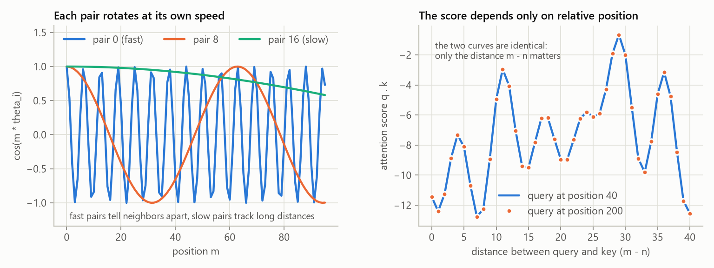

# Rotary Position Embeddings (RoPE)

Attention by itself has no idea of order: shuffle the tokens and every attention score stays
the same. The model has to be told where each token is.

## The classic way: a learned table

The classic model keeps a table with one learned vector per position and adds it to the
token embedding:

```python
x = self.token_embed(idx) + self.position_embed(self.pos_idxs[:T])
```

This works, with three weaknesses:

1. Positions the model never trained on have random vectors. The legacy config trains on
   16-token windows with a 512-position table, so positions 16 to 511 stay untrained, and
   generating past 16 tokens feeds the model noise. (`generate_text.py` now stays inside
   the trained window for exactly this reason.)
2. The model must learn from data that position 7 next to position 8 means the same as 107
   next to 108. Absolute positions make relative order a learned fact.
3. The table costs `context_length x n_embed` parameters.

## The rotary way

[RoPE](https://arxiv.org/abs/2104.09864) does not touch the embeddings. Inside attention, it
*rotates* each query and key vector by an angle proportional to its position. Split a head
vector of size `d` into `d/2` pairs. Pair `i` of a token at position `m` is rotated by the
angle `m * theta_i`, with

$$
\theta_i = \text{rope\_theta}^{-2i/d}, \qquad i = 0, 1, \ldots, d/2 - 1
$$

$$
\begin{pmatrix} x'_{i} \\ x'_{i + d/2} \end{pmatrix}
=
\begin{pmatrix} \cos m\theta_i & -\sin m\theta_i \\ \sin m\theta_i & \cos m\theta_i \end{pmatrix}
\begin{pmatrix} x_{i} \\ x_{i + d/2} \end{pmatrix}
$$

The key property: a rotation by angle `a` followed by the dot product with something rotated
by angle `b` only depends on `a - b`. So the attention score between a query at position `m`
and a key at position `n` depends only on the distance `m - n`:

$$
\langle R_m q,\; R_n k \rangle = \langle q,\; R_{n-m}\, k \rangle
$$

Attention now sees *relative* positions directly and there are no position parameters to
train. It does not make long contexts free, though: a model trained on 512-token windows has
never seen two tokens 2,000 positions apart, and the section on `rope_theta` below is about
exactly that.



The left plot shows why the frequencies are spread out. Early pairs spin fast (they tell
neighbors apart), late pairs spin slowly (they still distinguish tokens thousands of
positions apart). The right plot is the property above, measured: the score between a fixed
query and key only depends on how far apart they are, wherever the pair sits.

## The code

```python
def rope_cache(dim, max_len, theta=10_000.0):
    positions = torch.arange(max_len, dtype=torch.float32)
    angles = torch.outer(positions, rope_frequencies(dim, theta))    # (max_len, dim/2)
    return angles.cos(), angles.sin()

def apply_rope(x, cos, sin):                                         # x: (..., seq, dim)
    half = x.shape[-1] // 2
    x1, x2 = x[..., :half], x[..., half:]
    return torch.cat([x1 * cos - x2 * sin, x1 * sin + x2 * cos], dim=-1)
```

The tables are computed once and stored as non-persistent buffers, so they are not saved
in checkpoints. With a KV cache, the new token at position `p` uses row `p` of the tables,
which is why `forward_hidden` slices `rope_cos[start : start + T]`.

The pairs here are `(x[i], x[i + d/2])` (the "rotate half" layout used by most open code).
Meta's original Llama code pairs neighbors `(x[2i], x[2i+1])` instead. The two are the same
up to a fixed permutation of the dimensions, which the projection weights absorb.

Two tests pin the math: `test_rope_is_a_rotation_of_each_pair` compares every pair with an
explicit 2x2 rotation matrix, and `test_rope_scores_depend_only_on_relative_position` checks
the property above.

## Longer contexts and rope_theta

`rope_theta` sets the slowest frequency. The default 10,000 comes from the original paper.
Models with long contexts raise it (Llama 3 uses 500,000), which slows every pair down. With
64 pairs per head and a 128K-token context, no pair turns less than once across the whole
context at 10,000, while 15 of them do at 500,000, and those slow pairs are what can tell
far-apart positions apart. Methods that stretch a trained model to longer
contexts (position interpolation, NTK scaling, YaRN) all work by rescaling these
frequencies, which is easy precisely because positions live in one small function.

DeepSeek's multi-head latent attention uses RoPE on only a small part of each head (the
"decoupled" key); see [attention](attention.md#multi-head-latent-attention) for why.
