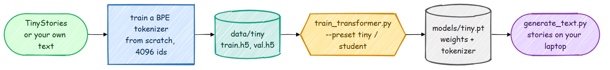

# Train an LLM on a Laptop (No GPU)

You do not need a GPU to learn how a language model is trained. This page trains a small
Transformer from scratch on a normal laptop CPU: the full pipeline, from raw text to a
tokenizer you trained yourself to a model that writes stories, in about ten minutes.



Here is what the smallest preset wrote after **8 minutes of training on a laptop CPU**
(636K parameters, the classic architecture):

```text
Once upon a time, there was a big, in a warm ball. The little boy was very independent and a
big green dog named Max. Max was excited to see a lot of the fire. He wanted to get down.
Lily walked outside to the park to see what to help them. Tim saw a big dog with a red tail,
and Sam. They thought it was not playing with the fire. Tim was so happy.
```

And the same preset with the modern architecture (369K parameters, 5 minutes):

```text
Once upon a time, there was a little girl named Lily. She lived in a big forest. She loved to
cook all his friends. One day, they loved to play in the park outside. Lily was very happy and
thanked her friend, a little girl named Mia. Mia would have a game with her friend, Sam. They
all played together, they were very happy.
```

The grammar is right, the characters have names, and sentences follow each other. The plot
wanders, because a model this small cannot hold a story together; the bigger presets below
get further. It is a great place to start.

> Training a tiny LLM from scratch is not the same as training a ChatGPT-scale model. The
> goal here is to understand every step by running it yourself. The same code scales up:
> the GPU presets and the post-training stages use exactly these building blocks.

## Step 1: Install

```bash
git clone https://github.com/FareedKhan-dev/train-llm-from-scratch.git
cd train-llm-from-scratch
uv sync                    # or: pip install -e .
```

On Windows and macOS the default PyTorch is already the CPU (or Apple MPS) build. On Linux,
`pip install torch --index-url https://download.pytorch.org/whl/cpu` first saves a 2.5 GB
CUDA download.

## Step 2: Prepare the data

```bash
python scripts/prepare_tiny_data.py
```

This downloads 25 MB of [TinyStories](https://arxiv.org/abs/2305.07759) (short stories
written with a small vocabulary, made for tiny models) and its validation file, trains a
4096-token **BPE tokenizer from scratch** on 10 MB of it, and writes the token streams:

```text
TinyStories V2 (roneneldan/TinyStories): 30,496 train / 5,000 val documents
Training a byte-level BPE tokenizer: vocab 4096 on 10.0 MB ...
  done in 3.7s
  wrote 6,095,088 tokens -> data/tiny/train.h5
  wrote 991,095 tokens -> data/tiny/val.h5
Done. 4.02 characters per token, vocab 4096.
```

The whole step takes about 25 seconds. Why train a tokenizer instead of using GPT-2's? A
model has one embedding row and one output row per token. With GPT-2's 50,257 tokens and
`n_embed = 64`, those two tables alone would hold 6.4M numbers, ten times the whole tiny
model, and most of that vocabulary never appears in children's stories. A 4096-token
vocabulary fitted to the data keeps the model small and fast. The tokenizer lives in
`src/tokenizer/bpe.py`; [Tokenizers: BPE from scratch](../foundations/bpe.md) explains it.

Other data:

```bash
python scripts/prepare_tiny_data.py --dataset shakespeare --vocab_size 2048
python scripts/prepare_tiny_data.py --dataset text --input my_notes.txt
python scripts/prepare_tiny_data.py --tokenizer r50k_base     # GPT-2's tokenizer instead
```

## Step 3: Train

```bash
python scripts/train_transformer.py --preset tiny
python scripts/train_transformer.py --preset tiny --arch modern     # the 2026 architecture
```

The vocabulary size and the tokenizer are read from the data file. You will see the loss
start at about 8.3 and fall:

```text
Total number of parameters in the model: 636,288 (classic architecture, vocab 4096)
Step: 0, Train loss: 8.3437, Dev loss: 8.3406
Step: 150, Train loss: 4.6711, Dev loss: 4.6813
Step: 600, Train loss: 3.7842, Dev loss: 3.8018
Step: 1350, Train loss: 3.2755, Dev loss: 3.3233
Finished training. Train loss: 3.2836, Dev loss: 3.3010
```

8.3 is not a random number: it is `ln(4096)`, the loss of a model that spreads its guess
evenly over all 4096 tokens. Everything below that line is something the model learned.


## Step 4: Generate

```bash
python scripts/generate_text.py --model_path models/tiny.pt --input_text "Once upon a time"
python scripts/generate_text.py --model_path models/tiny.pt --temperature 0.6 --top_k 20 --num_samples 3
```

Everything the model needs (its size, its architecture, its tokenizer) is stored in the
checkpoint. Lower temperatures give safer, more repetitive text; higher ones more surprising.

## The presets

| Preset | Layers | Heads | n_embed | Context | Steps | Parameters (classic / modern) | On our laptop CPU |
|---|---:|---:|---:|---:|---:|---:|---|
| `tiny` | 2 | 4 | 64 | 128 | 1,500 | 0.64M / 0.37M | 5 to 8 minutes, dev loss 3.30 / 2.78 |
| `student` | 4 | 6 | 192 | 256 | 4,000 | 3.4M / 2.6M | about 70 minutes; training loss 1.80 after 3,300 steps |
| `small` | 6 | 6 | 384 | 256 | 8,000 | 13.9M / 12.2M | several hours; minutes on any GPU |
| `13m`, `77m`, `3b` | | | | | | the README models | GPU, on the Pile data |

Parameter counts assume the 4096-token vocabulary. "Our laptop" is a 2025 Intel Core Ultra
7 255H using its CPU only. Our `student` run (modern architecture) shared the laptop with other
work: its first 400 steps took under 7 minutes, which puts the full 4,000 steps at about 70
minutes on a quiet machine, and it was stopped after 3,300 steps and two hours with a training
loss of 1.80. After 6.1M training tokens, everything the tiny preset ever sees, the student
model was already at 2.47 against the tiny model's 2.80: a bigger model learns more from the
same stories.

Your numbers will differ, so measure them:

```bash
python scripts/benchmark.py                          # tokens per second for each preset, both architectures
python scripts/model_report.py --preset student      # parameters, FLOPs, memory, Chinchilla-optimal data
```

Memory is not a problem at these sizes: the student preset needs well under 2 GB of RAM.

## Experiments worth running

Every preset value can be overridden, so the laptop is a real lab:

- **Classic vs modern.** Train both architectures with the same preset and compare the dev
  loss. On ours the modern model reached a lower loss with 42% fewer parameters. Read
  [the modern model](../modern/README.md) to see what changed, then switch parts off one at a
  time (`--set qk_norm=false`, `--set tie_embeddings=false`, `--set attention=mla`) to find
  out which ones matter at this size.
- **Tokenizer size.** Prepare the data with `--vocab_size 1024` and `8192`, train the same
  preset on each, and compare samples. (Compare samples, not losses: losses over different
  vocabularies are not directly comparable. Bits per character would be.)
- **Learning rate.** `--lr 3e-3` and `--lr 3e-4` against the preset's `2e-3`. Too high
  diverges, too low barely moves.
- **Data size vs model size.** The student preset sees about 33M tokens; `model_report.py`
  says 51M would be compute-optimal for its size. Try `--steps 6000`.

## Hardware notes

- **CPU threads.** PyTorch uses one thread per physical core. On hybrid CPUs (performance +
  efficiency cores) fewer threads can be faster; try `--threads 8` and compare with
  `scripts/benchmark.py --threads 8`.
- **Apple Silicon** is used automatically (`--device auto` picks MPS when there is no NVIDIA GPU).
- **Google Colab or Kaggle** give you a free GPU: the same commands run there, and the `small`
  preset trains in minutes.

## Where to go from here

1. Read **Step 2 of the README**, which builds the classic model one class at a time.
2. Read [the modern model](../modern/README.md) and train `--arch modern`.
3. Move to a GPU (Colab is enough) and train the `13m` preset on the Pile, as in the README.
4. Post-training (SFT, reward model, DPO, PPO, GRPO) uses the GPT-2 tokenizer and a chat
   format. To watch every stage run on a CPU without downloading anything, run the
   end-to-end test, which trains each one for a few steps on generated data:
   `pytest tests/test_pipeline_e2e.py -s`.
